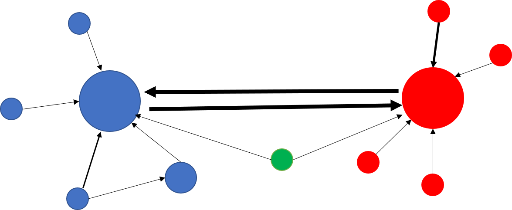

# CS-401 Applied Data Analysis Project
## U_Cite: Interactive American politician network inferred from public quotations  
 
## Team: Date A Data
- Castiglione Thomas `thomas.castiglione@epfl.ch`
- Chuanfang Ning `chuangfang.ning@epfl.ch`
- Guoyuan Liu `guoyuan.liu@epfl.ch`
- Irvin Mero `irvin.merozambrano@epfl.ch`
 
## Abstract:
It is well-known from public sentiment that the US has a bi-polar political landscape, with Democrats on one side and Republicans on the other. The project aims to verify and back up this assumption with quotebank data by visualizing the political landscape in a network model in which the individual politicians are considered as nodes and the mentions in between the politicians are considered as connections. The network connections will be analyzed in-depth to reveal the structure of central nodes and communities/hubs. The network will also be extended with machine learning techniques including sentiment analysis (supervised) and LDA topic clustering (unsupervised) to reveal more information (emotion and recurrent topics) in the mentions.
 
With this network model we will tell a data story about the bi-directional frequency, sentiment and topics when US politicians mention other politicians (self-mentions, US or world-wide). In particular, we will mention interesting conclusions and facts found with the help of interactive graphs with the network.
 
## Research Questions
With some [preliminary analysis](https://github.com/epfl-ada/ada-2021-project-date-a-data/blob/main/Milestone2/descriptive_statistics.ipynb), we found that 13% of the quotations are uttered by politicians. And 48% of the political quotations are from the US. With the rich political data in the dataset, we decide to analyze the network between politicians through their quotation and tell a datastory about the ecosystem of the political world focusing on the United States.

With Quotebank, we can extract the “mentioning” and “being mentioned” relationship among the politicians to build a political social network based on data from multiple news sources. This social network can be constructed on the domestic level including only American politicians and on the global level to show both the domestic and international network. One possible US political network is illustrated below, where blue and red color represent the two major parties in US and green nodes represents politician from others like Tea party.

 

The polarization of the United States politics is already backed by multiple studies, but many of them is done indirectly via survey on ideology or public behavior change ([NW et al., 2014](https://www.pewresearch.org/politics/2014/06/12/political-polarization-in-the-american-public/); [Wilson et al., 2020](https://psycnet.apa.org/record/2020-78563-040)). The network on the individual politician level is a direct reflection of the political structure with quantitative metrics like connectivity or betweenness centrality.

On a global level, some major events also occur during the time span of quotebank (2015 - 2020) like Brexit, the US-China trade war, COVID pandemic, etc., which could be interesting to see if it is reflected from the global political network.

 
## Proposed additional datasets
- [Partisan Audience Bias Scores](https://dataverse.harvard.edu/dataset.xhtml?persistentId=doi:10.7910/DVN/QAN5VX)
 
    This data set is made available from Harvard dataverse and contains 19023 domains with the bias score. The score is compiled from the sharing patterns by known Democrats and Republicans on Twitter.We plan to use the dataset to calibrate the source of quotation so that the distribution is centered and unbiased in terms of political ideology. This is relevant since we want to show an objective politician network that can reflect real situations instead of the potential bias from the media.
 
- [Wikidata](https://www.wikidata.org/wiki/Wikidata:Database_download)

    Wikidata is a free, structured database that serves as a general collection of knowledge. It is used to enrich the speakers in quotebank to include information like position, political party, nationality, date of death, etc. The size of the whole dump is over 100 GB and one query on it takes about 12 hours but it is manageable since one pass is adequate and the following analysis is done on much smaller subsets.
 
## Methods
The general pipeline of the project is [here](https://github.com/epfl-ada/ada-2021-project-date-a-data/blob/main/Milestone2/Project%20Pipeline.ipynb).
 
### A. Preprocessing:
1. Analyze the latest wikidata dump, build a catalogue by filtering out alive politicians with their qids, names, alternative names, nationalities and parties.
2. Use the catalogue to filter the Quotebank quotations from 2015 to 2020, which were uttered by US politicians with known names and parties.
3. Calibrate the source of quotations according to the media bias score to have a neutral sampling.
4. Cluster the politicians in two ways, i.e. by their parties (national) and by their nationality (international).
5. Query the filtered quotebank data and pick out the quotation lines which include the aliases of another politician(s).
### B. Data analysis:
 
1. Build a network model with following structures. Nodes are US politicians and edges are the mentioning or being mentioned in publicity (represented by the quotebank). The edge weight denotes the count of mentions and depending on the complexity for a clear diagram, only the top nodes with most connections are kept. This directed graph would show us the pattern of politician connection: e.g. whether they form clusters with the party members or tend to interact more with the rivals in other parties.
2. Do centrality analysis on the network to evaluate the importance of one nodes (politicians) based on the number of connections ([Borgatti et al., 2009](https://www.science.org/doi/full/10.1126/science.1165821)).
3. Do sentimental analysis with the `sentiment` module in `nltk` package, which is a model trained by supervised learning. The model will be applied on each quotation to have a sentiment score. We can then obtain statistically the tone when politicians mention party members and people outside the party. Here we are assuming the tone of the whole quotation also represents the attitude towards the person. 
4. Extract topics with Latent Dirchlet Allocation (LDA) method implemented in `Genism` package. The quotations with mentions will need to be tokenized and unrelated words need to be removed before feeding the unsupervised learning model. By aggregate all the quotations between every two parties with a certain tone and apply topic extraction, we can conclude which topics are more controversial  (more negative mentions) and which are more agreed between parties (more positive mentions). 
 
### C. Visualisation and Gitpage:
1. Visualize the network model in B.1 and add interactive functions like drop_down lists to select (overall/communities), zooming and tracking or untracking politicians in the graph according to their interest. Visualize the political landscape of the United States by drawing the network of US politicians. 
2. Create a github page to show the analysis, tell story and embed the interactive plots.

## Proposed timeline
- Network data processing on US and worldwide - 30 Nov
- Sentimental analysis and topic extraction - 6 Dec
- Interactive visualizations - 8 Dec
- Data story composition - 15 Dec
- Final check and submission - 17 Dec
 
 
## Organization within the team
- All: composing data story.
- Chuanfang: Remaining data cleaning and pipeline.
- Guoyuan: Sentimental analysis, topic extraction, media bias calibration.
- Irvin: Plots on US - Global political networks, web design for the data story.
- Thomas: statistical analysis, interactive plots on US politician networks.
 
 
## Questions for TAs (optional)
* Do you think we have adequate/too few/too much workload for our proposal? Is there anything you recommend us to add/remove? Is it possible to get a good grade (6.0) with everything done in the current project schema?
